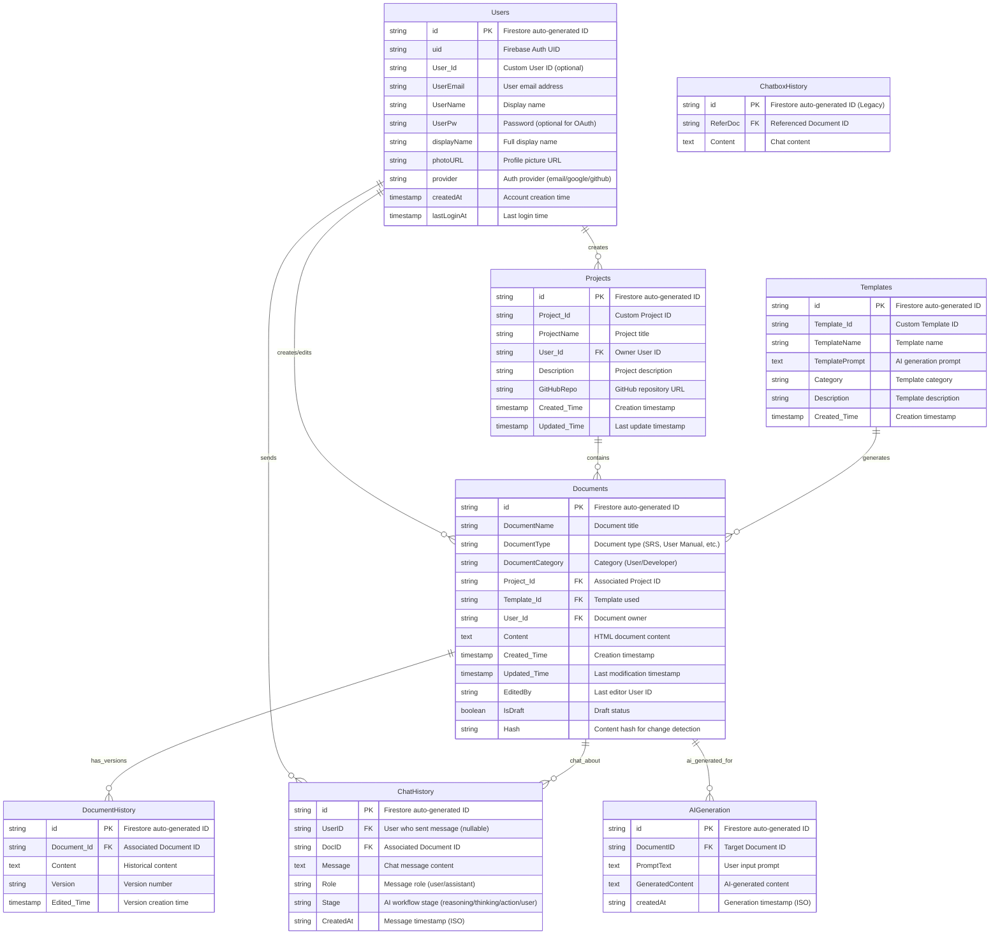

# Dotivra Firebase Database ERD

This document outlines the Entity Relationship Diagram for the Dotivra application's Firebase Firestore database structure.

## Database Schema Overview



## Collection Details

### Users Collection
- **Primary Key**: Firestore auto-generated `id`
- **Purpose**: Store user authentication and profile information
- **Integration**: Works with Firebase Authentication
- **Relationships**: 
  - One-to-many with Projects (user can create multiple projects)
  - One-to-many with Documents (user can create/edit multiple documents)
  - One-to-many with ChatHistory (user can send multiple messages)

### Projects Collection
- **Primary Key**: Firestore auto-generated `id`
- **Foreign Key**: `User_Id` references Users collection
- **Purpose**: Store project metadata and GitHub integration
- **Features**:
  - GitHub repository linking
  - Project ownership tracking
  - Creation and modification timestamps

### Documents Collection
- **Primary Key**: Firestore auto-generated `id`
- **Foreign Keys**: 
  - `Project_Id` references Projects collection
  - `Template_Id` references Templates collection
  - `User_Id` references Users collection
- **Purpose**: Store document content and metadata
- **Features**:
  - Rich text HTML content storage
  - Document categorization (User/Developer)
  - Version control integration
  - Draft state management
  - Content hash for change detection

### Templates Collection
- **Primary Key**: Firestore auto-generated `id`
- **Purpose**: Store document templates for AI generation
- **Features**:
  - AI prompt templates
  - Category-based organization
  - Reusable document structures

### DocumentHistory Collection
- **Primary Key**: Firestore auto-generated `id`
- **Foreign Key**: `Document_Id` references Documents collection
- **Purpose**: Version control for documents
- **Features**:
  - Complete content snapshots
  - Version numbering
  - Temporal tracking

### ChatHistory Collection
- **Primary Key**: Firestore auto-generated `id`
- **Foreign Keys**:
  - `UserID` references Users collection (nullable for AI messages)
  - `DocID` references Documents collection
- **Purpose**: Store chat conversations and AI workflow
- **Features**:
  - Support for AI workflow stages (reasoning, thinking, action)
  - User and AI message differentiation
  - Document-specific conversations

### AIGeneration Collection
- **Primary Key**: Firestore auto-generated `id`
- **Foreign Key**: `DocumentID` references Documents collection
- **Purpose**: Track AI-generated content
- **Features**:
  - Prompt and result tracking
  - Generation history
  - Content association with documents

### ChatboxHistory Collection (Legacy)
- **Status**: Legacy collection for backward compatibility
- **Purpose**: Original chat history implementation
- **Note**: Being replaced by ChatHistory collection

## Firebase Security Rules

```javascript
rules_version = '2';
service cloud.firestore {
  match /databases/{database}/documents {
    // Users can only access their own user document
    match /Users/{userId} {
      allow read, write: if request.auth != null && request.auth.uid == userId;
    }
    
    // Projects are accessible by their owners
    match /Projects/{projectId} {
      allow read, write: if request.auth != null && 
        request.auth.uid == resource.data.User_Id;
      allow create: if request.auth != null;
    }
    
    // Documents are accessible by project owners
    match /Documents/{documentId} {
      allow read, write: if request.auth != null && 
        request.auth.uid == resource.data.User_Id;
      allow create: if request.auth != null;
    }
    
    // Templates are readable by all authenticated users
    match /Templates/{templateId} {
      allow read: if request.auth != null;
      allow write: if request.auth != null; // Restrict in production
    }
    
    // Document history is readable by document owners
    match /{path=**}/DocumentHistory/{historyId} {
      allow read: if request.auth != null;
      allow write: if request.auth != null;
    }
    
    // Chat history is accessible by conversation participants
    match /ChatHistory/{chatId} {
      allow read, write: if request.auth != null && 
        request.auth.uid == resource.data.UserID;
    }
  }
}
```

## API Endpoints

### Project Management
- `GET /api/projects` - List all projects
- `GET /api/projects/:id` - Get specific project
- `GET /api/projects/user/:userId` - Get user's projects
- `POST /api/projects` - Create new project
- `PUT /api/projects/:id` - Update project
- `DELETE /api/projects/:id` - Delete project

### Document Management
- `GET /api/project/:projectId/documents` - List project documents
- `GET /api/document/editor/content/:docId` - Get document content
- `PUT /api/document/editor/content/:docId` - Update document content
- `DELETE /api/document/:docId` - Delete document
- `GET /api/document/editor/history/:docId` - Get document history
- `GET /api/document/editor/summary/:docId` - Get latest AI summary

### Chat & AI Integration
- `GET /api/document/chat/history/:docId` - Get chat history
- `POST /api/document/chat/prompt` - Send chat message
- `GET /api/document/chat/agent/:docId` - Get AI workflow messages
- `POST /api/document/chat/agent` - Add AI workflow step
- `GET /api/document/chat/agent/action/:docId` - Get latest AI action

### User Management
- `POST /api/users` - Create user
- `GET /api/users/email/:email` - Get user by email
- `PUT /api/profile/edit` - Update user profile
- `DELETE /api/profile/delete` - Delete user account

## Environment Configuration

The application uses environment variables for Firebase configuration:

```env
# Firebase Configuration (Frontend)
VITE_FIREBASE_API_KEY=your_firebase_api_key
VITE_FIREBASE_AUTH_DOMAIN=your_project.firebaseapp.com
VITE_FIREBASE_PROJECT_ID=your_project_id
VITE_FIREBASE_STORAGE_BUCKET=your_project.firebasestorage.app
VITE_FIREBASE_MESSAGING_SENDER_ID=your_sender_id
VITE_FIREBASE_APP_ID=your_app_id
VITE_FIREBASE_MEASUREMENT_ID=your_measurement_id
```

## Key Features

1. **Firebase Authentication Integration**: Supports email/password, Google, and GitHub authentication
2. **Real-time Collaboration**: Firestore real-time listeners for live document editing
3. **Version Control**: Complete document history tracking with versioning
4. **AI Integration**: Structured chat workflow for AI-assisted document generation
5. **GitHub Integration**: Project linking with GitHub repositories
6. **Multi-tenant Architecture**: User-based data isolation with security rules
7. **Rich Document Editing**: HTML content storage with TipTap editor integration
8. **Template System**: Reusable document templates for AI generation

## Migration Notes

This ERD reflects the current implementation as of October 2025. Key changes from the original design:

1. **Removed AI table**: AI functionality is now integrated through ChatHistory and AIGeneration collections
2. **Enhanced User model**: Added Firebase Auth integration fields
3. **Improved Document model**: Added version control, draft status, and content hashing
4. **Structured Chat**: Separated chat functionality into workflow-aware ChatHistory
5. **Template Enhancement**: Added categorization and AI prompt support

The database structure supports the application's core features: document collaboration, AI-assisted content generation, project management, and real-time communication.